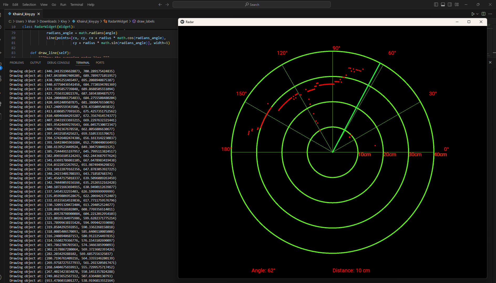

# My-Kivy-Radar

This project is a radar application built using **Kivy** and **Python** that reads sensor data from a serial port (such as an ultrasonic sensor connected to an Arduino) and visualizes it on a radar interface. The radar shows a sweeping green line that detects objects and marks them as red dots based on the angle and distance.



## Features
- Real-time radar display showing detected objects.
- Sweeping radar line with detected objects highlighted as red dots.
- Customizable maximum detection range (default: 40 cm).
- Easy to integrate with hardware like ultrasonic sensors.
- No need for Arduino IDE, the entire project runs in VS Code using Python.

## Table of Contents
- [Installation](#installation)
- [Requirements](#requirements)
- [Setup Instructions](#setup-instructions)
- [How to Run](#how-to-run)
- [Understanding the Code](#understanding-the-code)
- [Hardware Integration](#hardware-integration)
- [Troubleshooting](#troubleshooting)
- [License](#license)
- [Acknowledgments](#acknowledgments)

## Installation

Follow these instructions to set up the project on your local machine.

### Clone the Repository
First, clone the repository from GitHub to your local machine:

\```bash
git clone https://github.com/khairul-me/My-Kivy-Radar.git
\```

Navigate to the project directory:

\```bash
cd My-Kivy-Radar
\```

## Requirements

This project requires **Python** and the following Python packages:
- **Kivy**: For creating the radar GUI.
- **PySerial**: For reading data from the serial port.

To install these dependencies, run:

\```bash
pip install kivy pyserial
\```

## Setup Instructions

1. **Hardware**: Connect an **Arduino** (or similar microcontroller) to your computer via a **USB port**. Attach a **sonar sensor** (like an HC-SR04 ultrasonic sensor) to the Arduino to measure distance and send the results through the serial port.

2. **Python Configuration**:
   - **Serial Port**: Make sure to update the \`self.serial_port = serial.Serial('COM3', 9600)\` line in your \`RadarWidget\` class to match your system's serial port:
     - On Windows: \`COM3\`, \`COM4\`, etc.
     - On Linux/macOS: \`/dev/ttyUSB0\`, \`/dev/ttyS0\`, etc.

3. **File Overview**:
   - \`Khairul_kivy.py\`: The main Python script that contains the radar logic.
   - \`README.md\`: This file, which provides detailed information about the project.

## How to Run

Once everything is set up and installed, you can run the project by executing the Python script.

1. **Open Terminal/Command Prompt**:
   - Open a terminal or command prompt in the project directory.

2. **Run the Python Script**:

\```bash
python Khairul_kivy.py
\```

The radar interface will appear, and the green sweeping line will start moving, detecting objects within range (based on the serial data being sent from the Arduino).

## Understanding the Code

### Key Components:
1. **RadarWidget Class**: 
   - This class is responsible for the radar interface, including drawing the radar arcs, the sweeping line, and detecting objects.
   - The **update_radar()** method updates the radar interface regularly at 30 FPS to ensure smooth animation.
   
2. **Serial Data**:
   - The serial data is read in the **read_serial_data()** method. It expects data in the format \`Angle: X degrees, Distance: Y cm\`.
   - Ensure that the microcontroller is sending data in this format.

3. **Visual Representation**:
   - The **sweeping line** rotates around the radar, and any object detected within the range is displayed as a red dot based on the angle and distance.
   - You can adjust the maximum detection range by changing the \`self.max_distance\` variable (currently set to 40 cm).

## Hardware Integration

The radar app is designed to work with external hardware, such as an ultrasonic sensor connected to an Arduino. Here’s how to integrate the radar with your hardware:

### Arduino Code Example
You can use the following simple Arduino code to read data from an ultrasonic sensor and send it to the radar application over serial.

\```cpp
#define TRIG_PIN 9
#define ECHO_PIN 10

void setup() {
  Serial.begin(9600);
  pinMode(TRIG_PIN, OUTPUT);
  pinMode(ECHO_PIN, INPUT);
}

void loop() {
  long duration, distance;
  
  digitalWrite(TRIG_PIN, LOW);
  delayMicroseconds(2);
  
  digitalWrite(TRIG_PIN, HIGH);
  delayMicroseconds(10);
  digitalWrite(TRIG_PIN, LOW);
  
  duration = pulseIn(ECHO_PIN, HIGH);
  distance = (duration / 2) / 29.1; // Convert to cm

  int angle = 0;  // Replace this with your actual angle logic if rotating the sensor
  
  // Send angle and distance to Python program
  Serial.print("Angle: ");
  Serial.print(angle);
  Serial.print(", Distance: ");
  Serial.print(distance);
  Serial.println(" cm");
  
  delay(100);
}
\```

### Connecting to Python:
Once the Arduino is connected to your PC and sending serial data, the Python code reads the serial output and displays the corresponding object on the radar.

## Troubleshooting

1. **No serial data detected**:
   - Ensure your Arduino is properly connected and the correct serial port is specified in the Python code (\`self.serial_port\`).

2. **Slow radar performance**:
   - Adjust the FPS (frames per second) or serial data read frequency to match the performance of your system and hardware.

## License

This project is licensed under the **MIT License**. Feel free to use, modify, and distribute this code, but please give credit where it’s due!

## Acknowledgments

This project was developed by **Khairul Islam**, a passionate robotics enthusiast. Special thanks to the open-source community and all contributors to Kivy and PySerial libraries, as well as everyone who has supported this project.

Feel free to reach out via GitHub or [LinkedIn](https://www.linkedin.com/in/khairul7/) for any questions or collaboration opportunities.
